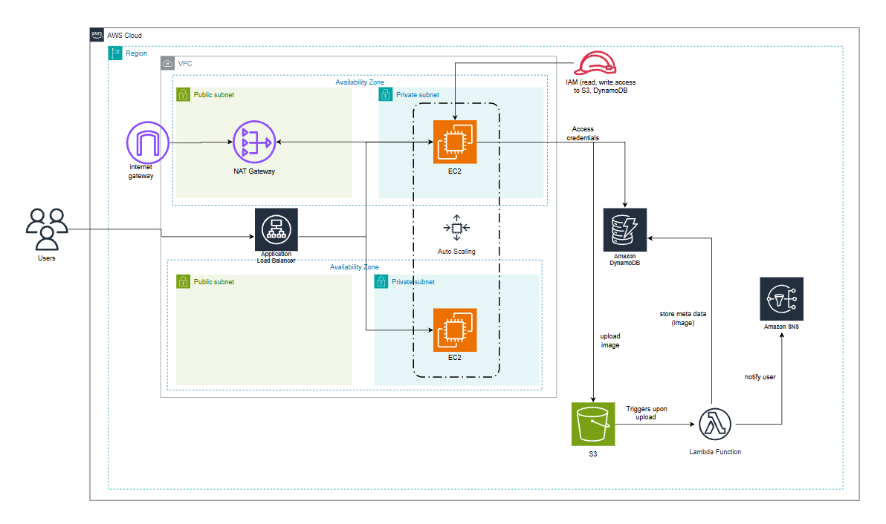

# AWS Serverless image processor for a fictional company

# A 3-tier cloud application that handles image uploads, processing of metadata automatically and sends real-time notifcations to users email. 

## The Project
Workflow of this project
1.  **Web Access:** Users log in to a dashboard to view their images.
2.  **Uploads:** Images are uploaded directly to S3.
3.  **Automation:** Every upload triggers a Lambda function to extract metadata (filename, size, upload time).
4.  **Notification:** The system sends an Email via SNS when processing is done.

## tech stack
* **Frontend:** Python Flask on EC2 (Auto Scaling Group + Application Load Balancer).
* **Backend:** AWS Lambda (Python 3.12).
* **Storage:** Amazon S3 (Private Bucket).
* **Database:** Amazon DynamoDB.
* **Alerts:** Amazon SNS.

## Architecture Notes
* **Security:** The EC2 instances sit in a Private Subnet behind a NAT Gateway (Public Subnet) for security.
* **Cost:** The NAT Gateway costs ~ USD $30/month. for cheaper non-production builds, we can manuallly install the python packages into the EC2 server.

## How to Run
1.  **Launch EC2:** Use the `user_data` script to install Flask and Boto3.
2.  **Deploy Lambda:** Paste `lambda_function.py` into the AWS Console.
3.  **Connect S3:** Add an "Event Notification" to your bucket to trigger the Lambda.
4.  **Env Vars:** Update the `BUCKET_NAME` and `SNS_TOPIC_ARN` in the code with your own.

## prerequisites (important!)
1.  **Create VPC & others:** VPC & Availablity Zones.
2.  **Networking & others:** Security Groups, Route tables, Internet Gateway and NAT gateway.
3.  **DynamoDB:** Set up DynamoDB with metadata and username with password tables.
4.  **Lambda:** Create a Lambda function with S3 as a trigger.
5.  **Amazon SNS:** Create Topic and Subscriptions.
6.  **High Availablity:** Create Auto Scaling Group & Application Load Balancer followed with Target Group.
7.  **Web Server:** Use an EC2 launch template to launch our web server.
